# SSAFY PEDIA - DB 영화 추천 WEB

### 서울 3반 이민아, 서울 3반 조규태


> Welcome to the **SSAFY PEDIA**


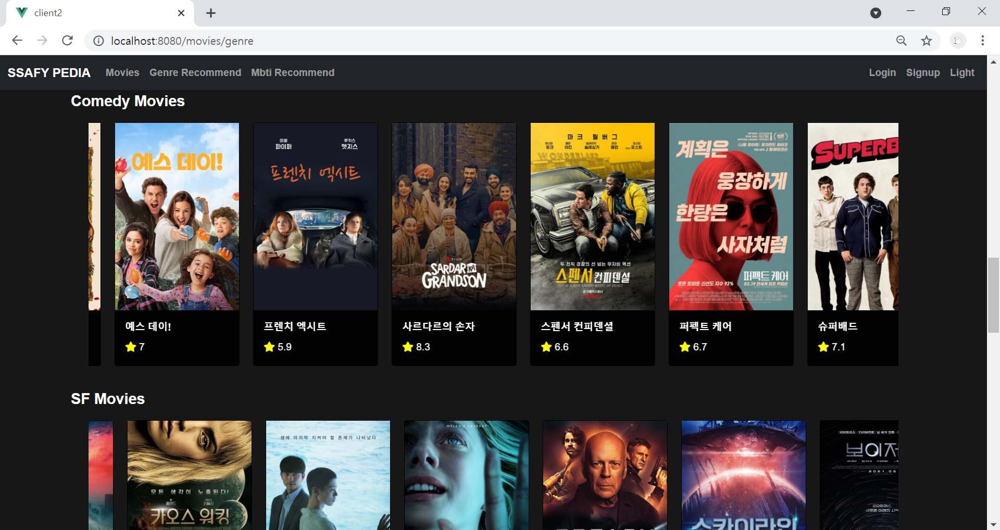


---

## Index


- [Environment](#environment)
- [Team Information](#team-information)
- [Structure](#structure)
- [Front-end (Vue.js)](#front-end)
- [Back-end (Django Rest Framework)](#back-end)


---

## Environment


### 1. 개발 환경

- Django 3.1.3

- vue/cli 4.5.8


### 2. 배포 서버 URL 

- https://ssafypedia.netlify.app


### 3. Django Command

- [Django]

  ```python
  python -m venv venv
  source venv/Scripts/activate
  pip install -r requirements.txt
  python manage.py makemigrations
  python manage.py migrate
  python manage.py loaddata movies/mbti.json
  python manage.py loaddata movies/movie.json
  python manage.py runserver
  ```


- 프로젝트 생성 (pjt)
  - django-admin startproject final_pjt .(final_pjt와 manage.py 바로 생성)
  - django-admin startproject final_pjt (final_pjt와 final_pjt/manage.py 생성)
- app 생성 (app)

  - python manage.py startapp movies : movies app 생성
  - python manage.py startapp accounts : accounts app 생성

- 서버 연결 (server)

  - python manage.py runserver : 페이지 연결

- 버젼 (requirements.txt)

  - pip freeze > requirements.txt : 버젼 저장
  - pip install -r requirements.txt : 버젼 조회 및 다운로드

- 가상환경 (venv)

  - python -m venv venv  :  가상환경 폴더 생성
  - source venv/Scripts/activate : 가상환경 실행
  - deactivate : 가상환경 해제
  - pip list : 가상환경 설치된 목록 확인

- 설치 (settings.py)
  - pip install django : django 설치
  - pip install djangorestframework : DRF 설치 

  - pip install django-cors-headers : cors-headers 생성 (django와 vuex)

  - pip install djangorestframework-jwt : 토큰베이스 아이디 로그인

- 관리자 (admin.py)

  - python manage.py createsuperuser : 관리자 계정 생성

- DB 동기화 (app/migrations, app/fixtures)

  - python manage.py makemigrations : migrations 폴더 아래 하위 파일 생성
  - python manage.py migrate : 실행할 때마다 명령어
  - python manage.py loaddata movies/mbti.json : fixtures/movies/mbti.json `movies.mbti` table 
  - python manage.py loaddata movies/movie.json : fixtures/movies/movie.json `movies.movie` table


### 4. Vue.js Command

- [Vue.js]

  ```python
  npm install
  npm run serve
  ```

- 뷰엑스 (store)

  - npm i vuex
  
  - vue add vuex
  
- 라우터 (router)

  - npm i vue-router 
  
  - vue add router
  
- 뷰 글라이드

  - npm i vue-glide-js
  
  

---

## Team Information


### 1. 팀원 정보

- 이민아

>  Back(DRF) , Front(Vue.js template), Mbti Data(JSON), README

- 조규태

> Front(Vue.js script), TMDB Data(JSON), ERD,  Deployment


### 2. 후기

- 이민아

> 끊임없는 뷰와의 콘솔 에러 전쟁이라고 해도 과언이 아닌 프로젝트였습니다. 하지만 그만큼 SSAFY에서 한 학기동안 배운 것을 돌아보면서 5개월의 시간동안 스스로가 얼만큼 성장하고 변할 수 있는 시간인지 돌아보는 기회이기도 했습니다. Back을 담당하면서 DRF로 데이터를 보내는 방법부터, 어떤 타입의 데이터를 보낼지 고민하는 시간을 그 어느 때보다 많이 가졌습니다. 그만큼 값진 시간이라고 느껴지고 개인적으로 뷰 글라이드와 다크모드를 페어와 계속 논의하며 구현한 것이 가장 뿌듯한 일이었던 것 같습니다. 시간상의 제약으로 인해 mbti의 영화를 수작업으로 데이터를 모아서 다른 모델로 구성하면서 mbti 추천 영화의 리뷰 및 댓글 기능을 완성시키지 못한 점이 아쉬웠습니다. 하지만 mbti 추천 영화를 위해 주변에 설문 조사를 진행하고 이를 바탕으로 직접 model의 field를 어떻게 구상할지 고민하는 시간을 가지면서 JSON 데이터에 대한 이해도를 더욱 높일 수 있는 시간이었습니다. 더불어 상세 영화 조회에서 유튜브 axios 요청도 시도하고 싶었으나 다크모드를 구현하고 이를 고민하는 과정에 시간을 할애하기로 결정하여 성취하지 못한 점이 아쉬웠고 다음 프로젝트에서 이를 보완하여 더욱 완성도 높은 프로젝트를 만들고 싶습니다.

- 조규태


---

## Structure


### 1. Structure 

#### (1) Front-end (Vue.js)

- public

  - index.html

    CDN (Bootstrap, Fontawesome)

- src

  - App.vue

    Navbar

  - router 

    - index.js (Vue router)

  - store 

    - index.js (Vuex)

      login, logout, signup, darkmode

  - views 

    - accounts (Vue router)

      | accounts                         | components     | components        |
      | -------------------------------- | -------------- | ----------------- |
      | **Login.vue**                    |                |                   |
      | **Signup.vue**                   |                |                   |
      | **MyProfile.vue /  Profile.vue** | MyComments.vue | MyCommentList.vue |
      |                                  | Movies.vue     |                   |
      |                                  | ReviewList.vue |                   |

    - mbtis (Vue router)

      | mbtis        | components | components   | components     |
      | ------------ | ---------- | ------------ | -------------- |
      | **Mbti.vue** | Mbtis.vue  | MbtiList.vue | MbtiDetail.vue |

    - movies (Vue router)

      | movies              | components       | components       | components        |
      | ------------------- | ---------------- | ---------------- | ----------------- |
      | **Movie.vue**       | Movies.vue       |                  |                   |
      | **Genre.vue**       | Movies.vue       |                  |                   |
      | **Movies.vue**      | MovieList.vue    | MovieDetail.vue  |                   |
      | **MovieDetail.vue** | ReviewList.vue   |                  |                   |
      |                     | CreateReview.vue |                  |                   |
      | **ReviewList.vue**  | Review.vue       | ReviewDetail.vue | CreateComment.vue |

#### (2) Back-end (Django Rest Framework)

| movies                                                       | accounts                               |
| :----------------------------------------------------------- | :------------------------------------- |
| 전체 영화 조회(GET)<br>개봉일순, 평점순 추천 영화 조회 (GET)<br>장르별 추천 영화 조회 (GET) | 회원가입(POST)                         |
| mbti 추천 영화 조회 (GET)                                    |                                        |
| 상세 mbti 영화 조회(GET)                                     | 로그인                                 |
| 상세 영화 조회(GET) <br>상세 영화 좋아요(POST) <br>상세 영화 전체 리뷰 조회(GET) 리뷰 생성(POST) |                                        |
| 상세 영화 상세 리뷰 조회(GET), 수정(PUT), 삭제(DELETE)       |                                        |
| 상세 영화 상세 리뷰 전체 댓글 조회(GET)  <br>상세 영화 상세 리뷰 댓글 생성(POST) <br/>상세 영화 상세 리뷰 상세 댓글 삭제 (DELETE) |                                        |
| 사용자가 좋아요한 영화 (GET) <br>사용자가 생성한 리뷰 조회 (GET) <br/>사용자가 생성한 댓글 조회 (GET) | 본인 프로필(POST)<br>타인 프로필(POST) |


### 2. 목표 및 구현

>  목표 서비스 및 실제 구현 정도 비교 

| 분야                 | 목표 서비스                                          | 실제 구현 |
| -------------------- | ---------------------------------------------------- | --------- |
| **App.vue**          | **Search Bar 기능**                                  | **X**     |
|                      | 위에 고정 (sticky-top)                               | O         |
|                      | 다크모드                                             | O         |
| **Movie.vue**        | **랜덤 추천 영화 조회 (R)**                          | **X**     |
|                      | 개봉일순 추천 영화 조회 (R)                          | O         |
|                      | 평점순 추천 영화 조회 (R)                            | O         |
|                      | Movie Vue glide Autoplay (클릭시 MovieDetail 이동)   | O         |
| **MovieDetail.vue**  | **영화 관련 유튜브 axios 요청**                      | **X**     |
|                      | Review (CR) 기능                                     | O         |
|                      | Review Vue glide (R) (버튼 클릭시 ReviewDetail 이동) | O         |
|                      | Review Rating Star (CR)                              | O         |
| **ReviewDetail.vue** | Review Rating Star (R)                               | O         |
|                      | Review (RUD) 기능                                    | O         |
|                      | Comment (CRD) 기능                                   | O         |
|                      | 리뷰 작성자 혹은 댓글 작성자 클릭시 Profile.vue 이동 | O         |
|                      | 영화 제목 클릭시 MovieDetail.vue 이동                | O         |
| **Genre.vue**        | 장르별 추천 영화 조회                                | O         |
|                      | Movie Vue glide Autoplay (클릭시 MovieDetail 이동)   | O         |
| **Mbiti.vue**        | mbti 유형별 추천 영화 조회                           | O         |
|                      | Movie Vue glide Autoplay (클릭시 MbtiDetail 이동)    | O         |
| **MbitiDetail.vue**  | **Mbti Review 및 Comment(CRUD) 기능**                | **X**     |
|                      | 상세 mbti 영화 조회                                  | O         |
| **MyProfile.vue**    | 홈페이지 메뉴얼 (버튼 클릭시 오픈 혹은 취소)         | O         |
| **(My)Profile.vue**  | 사용자가 좋아요한 영화                               | O         |
|                      | Movie Vue glide Autoplay (클릭시 MovieDetail 이동)   | O         |
|                      | 사용자가 작성한 리뷰                                 | O         |
|                      | Review Vue glide (R) (버튼 클릭시 ReviewDetail 이동) | O         |
|                      | 사용자가 작성한 댓글                                 | O         |
|                      | 사용자가 작성한 댓글의 해당 영화 혹은 리뷰 이동 버튼 | O         |
| **Login.vue**        | 로그인 엔터 혹은 버튼 클릭 후 MyProfile.vue 이동     | O         |
| **Signup.vue**       | 회원가입 후 Login.vue 이동                           | O         |


---

## Front-end


> Vue.js


### 1. HomePage Recommend


**SSAFY PEDIA**의 홈페이지는 가장 먼저 **평점 및 개봉일**을 기준으로 영화 추천 목록을 제시합니다.

각 카드들이 **자동으로 이동**하여 사용자의 가독성을 더욱 높였습니다.

**카드를 클릭**하면 로그인한 경우 상세 영화 조회 페이지로 이동하며 이는 로그인한 사용자만 조회가 가능합니다.

**로그인을 하지 않으면 로그인 페이지로 이동한 이후**에 사용이 가능합니다.

상세 영화 조회 페이지로 이동하는 경우 **영화 좋아요, 리뷰 작성 및 조회**가 가능합니다.


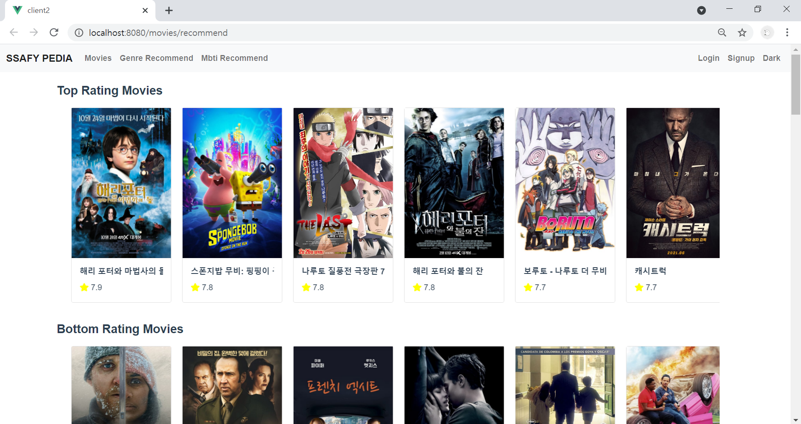


**SSAFY PEDIA**의 **모든 페이지**는 NavBar의 **최우측 상단**에 있는 **Light 혹은 Dark를 클릭**하면 다크 모드 혹은 라이트 모드로 변경하여 사용자가 시각적으로 편안하도록 선택지를 다채롭게 만들었습니다.


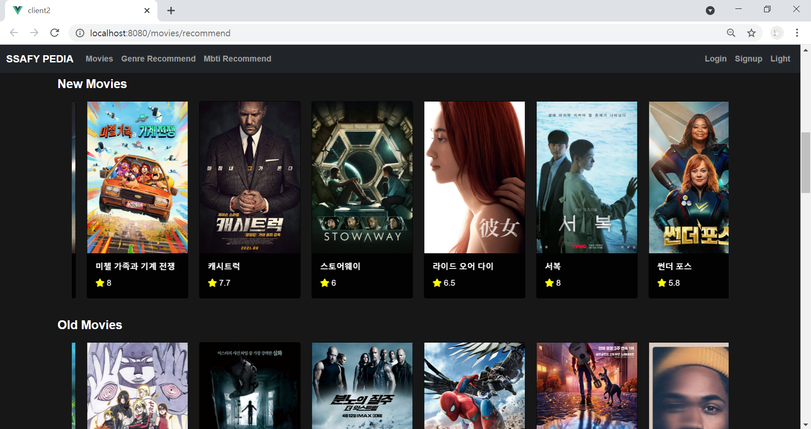


### 2. Genre Recommend 


**SSAFY PEDIA**의 Genre Recommend는 TMDB의 인기 영화 약 160개의 데이터 중 **액션, 애니메이션, SF, 코미디 등**의 **장르별로** 영화를 추천하는 코너입니다.

각 카드들이 **자동으로 이동**하여 사용자의 가독성을 더욱 높였습니다.

**카드를 클릭**하면 로그인한 경우 상세 영화 조회 페이지로 이동하며 이는 로그인한 사용자만 조회가 가능합니다.

**로그인을 하지 않으면 로그인 페이지로 이동한 이후**에 사용이 가능합니다.

상세 영화 조회 페이지로 이동하는 경우 **영화 좋아요, 리뷰 작성 및 조회**가 가능합니다.


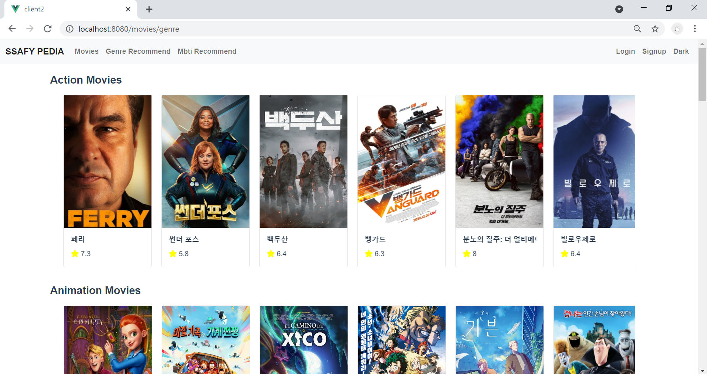


### 3. Mbti Recommend 


**SSAFY PEDIA**의 Mbti Recommend는 TMDB의 인기 영화 64개(16개의 유형마다 **4개**의 추천)의 데이터 중 **MBTI 성격 유형별로** 영화를 추천하는 코너입니다.

각 카드들이 **자동으로 이동**하여 사용자의 가독성을 더욱 높였습니다.

**카드를 클릭**하면 로그인한 경우 상세 영화 조회 페이지로 이동하며 이는 로그인한 사용자만 조회가 가능합니다.

**로그인을 하지 않으면 로그인 페이지로 이동한 이후**에 사용이 가능합니다.

상세 영화 조회 페이지로 이동하는 경우 영화 좋아요, 리뷰 작성 및 조회가 **불가능**하며 영화 제목, 줄거리, 평점 등의 **상세 영화 정보를 조회**할 수 있습니다.


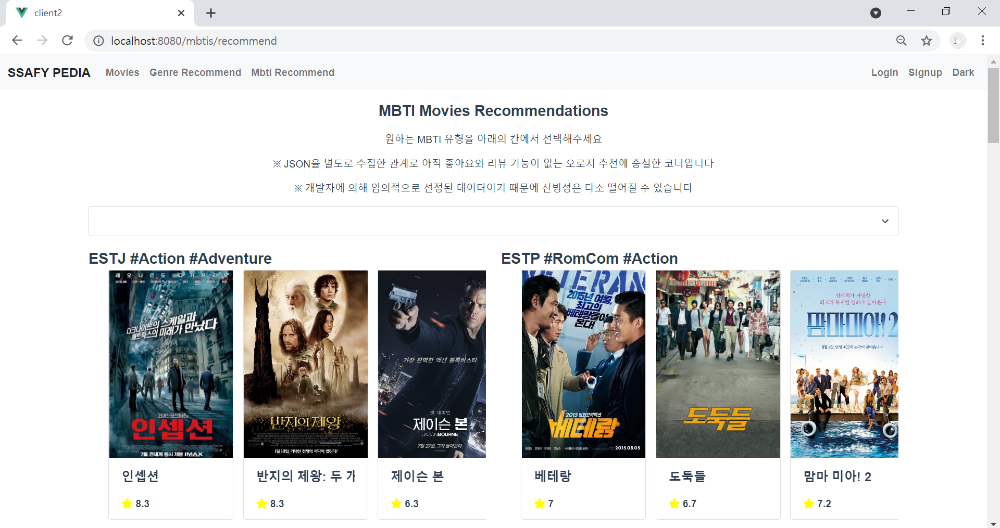

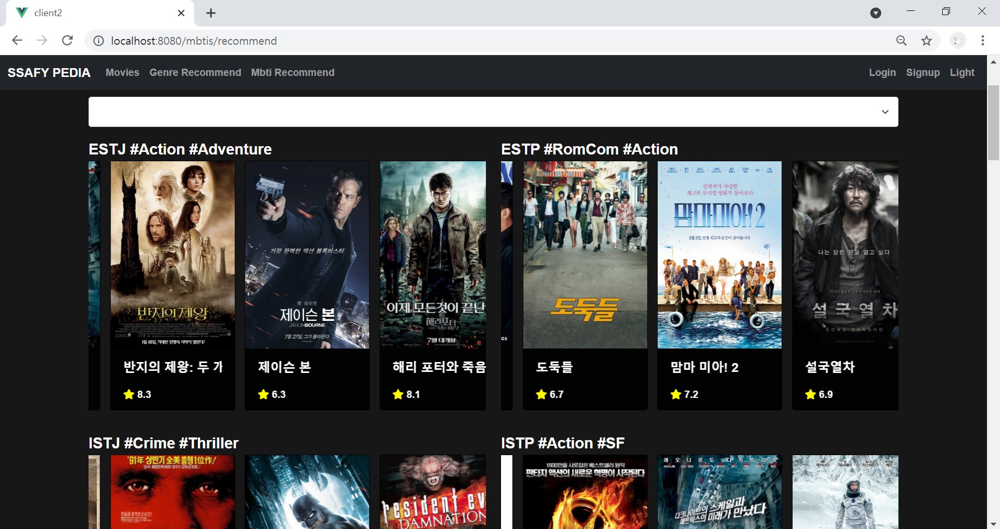


다음과 같이 **특정 MBTI 유형을 선택**하면 **필터링**하여 추천 영화를 볼 수 있습니다.  

**다시 전체** 유형의 추천 영화 조회를 원하는 경우 **ALL을 클릭**하여 **전체 조회**가 가능합니다. 


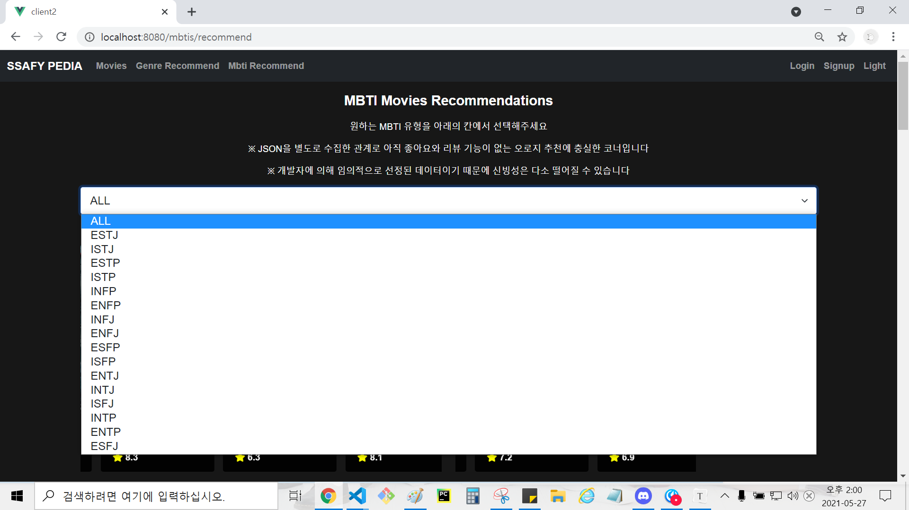

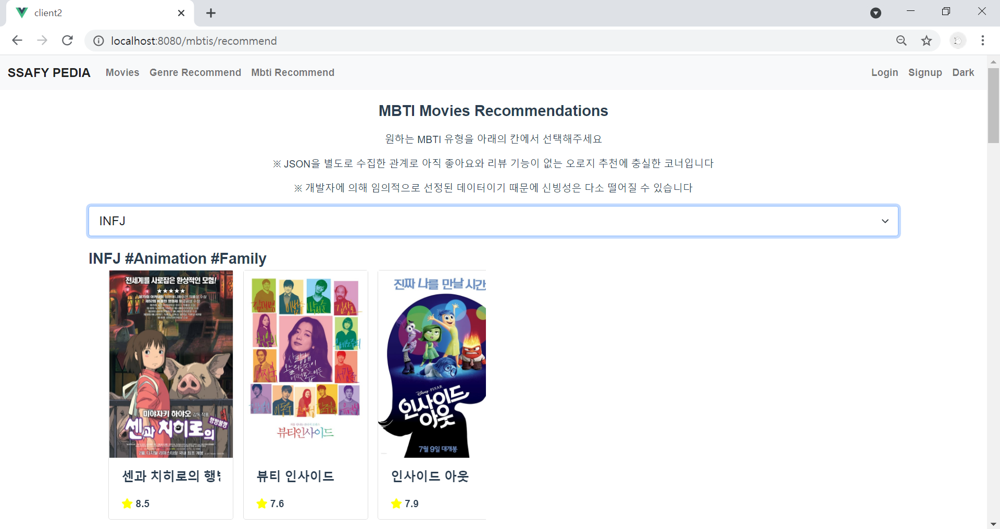


### 4. SignUp & Login


**회원가입**을 하는 경우 ID, PASSWORD뿐만 아니라 **성(Last Name)과 이름(First Name)**을 입력해야 합니다.

로그인 이후 생기는 NavBar 상단 우측의 **본인의 프로필**에서 오직 사용자 **본인만**이 자신의 **성(Last Name)과 이름(First Name)**을 볼 수 있습니다. **타인**에게 공개되는 부분은 **ID**입니다.


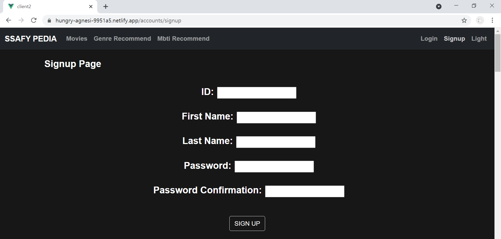


회원가입을 **완료**한 이후 **로그인 페이지**로 이동하게 됩니다.

혹은 영화 추천 페이지에서 카드를 클릭하여 **상세 영화 조회**를 원하는 경우 **로그인을 해야 합니다**.

로그인에 성공하면 바로 **본인**의 **프로필** 페이지로 이동합니다. 


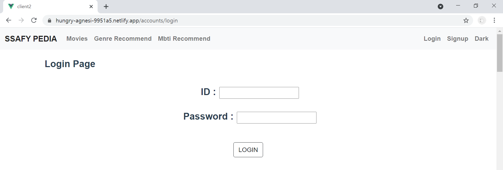


### 5. My Profile


**로그인한 직후** 바로 **본인**의 프로필로 이동합니다. 

본인의 프로필에서 HomePage Manual의 **DETAIL 버튼을 클릭**하면 홈페이지 **사용 메뉴얼**을 살필 수 있습니다.


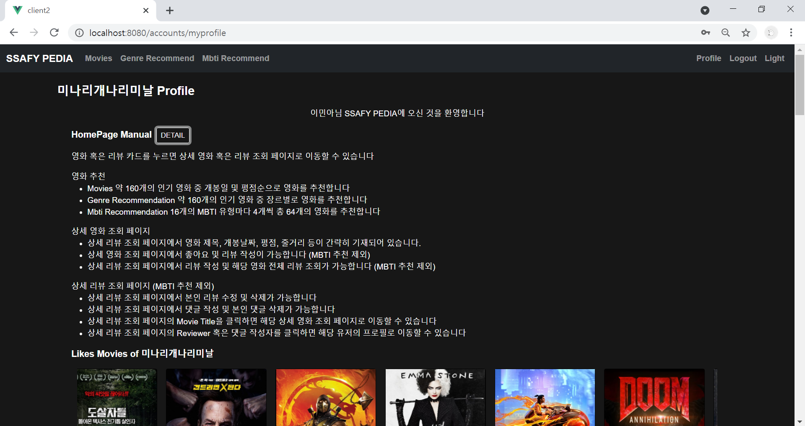


이외에도 본인의 **프로필**에서는 **사용자가 좋아요한 영화, 사용자가 작성한 리뷰, 사용자가 작성한 댓글**을 조회할 수 있습니다.


**상단**에 위치한 사용자가 좋아요한 영화는 영화 추천 페이지처럼 각 카드들이 **자동으로 이동**하여 사용자의 가독성을 높였습니다.

**카드를 클릭**하면 로그인한 경우 **상세 영화 조회 페이지**로 이동합니다.

상세 영화 조회 페이지로 이동하는 경우 **영화 좋아요, 리뷰 작성 및 조회**가 가능합니다.


**중간**에 위치한 사용자가 작성한 리뷰는 **Review Detail 버튼을 클릭**하면 **상세 리뷰 조회 페이지**로 이동합니다.

상세 리뷰 조회 페이지로 이동하는 경우 **리뷰 조회, 수정 및 삭제**, **댓글 조회, 생성 및 삭제**가 가능합니다. 


**하단**에서는 사용자가 작성한 댓글들의 내용과 작성 시간을 조회할 수 있습니다. 

**REVIEW DETAIL 버튼을 클릭**하면 댓글이 작성된 **상세 리뷰 조회** 페이지로 이동합니다.

상세 리뷰 조회 페이지로 이동하는 경우 **리뷰 조회, 수정 및 삭제**, **댓글 조회, 생성 및 삭제**가 가능합니다. 

**MOVIE DETAIL 버튼을 클릭**하면 댓글이 작성된 리뷰의 해당 **상세 영화 조회** 페이지로 이동합니다.

상세 영화 조회 페이지로 이동하는 경우 **영화 좋아요, 리뷰 작성 및 조회**가 가능합니다.


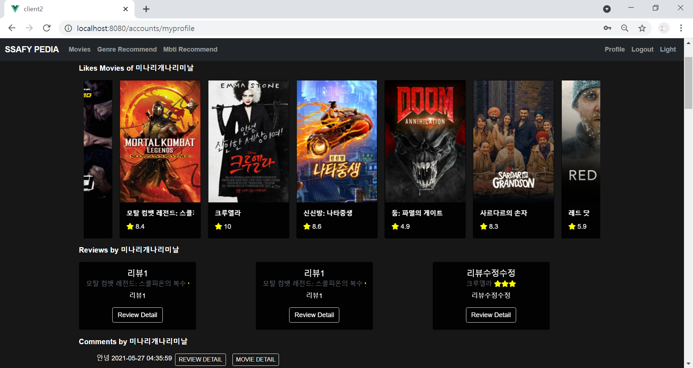


### 6. Movie Detail  

 

**하트 버튼을 클릭**하면 **좋아요 기능**을 실행할 수 있습니다. 좋아요 **취소**를 원하는 경우 **다시 한 번 하트를 클릭**하면 좋아요가 취소됩니다.


**Review Create 버튼을 클릭**하면 하단의 전체 리뷰 조회 슬라이드에 새로운 리뷰가 생성됩니다.

**마우스로 우측 방향**으로 움직이면 **전체 리뷰를 조회**할 수 있으며 **최신** 리뷰는 **가장 우측**에 배치하게 됩니다.

리뷰는 **제목, 평점, 내용** 3가지의 값을 모두 입력해야 합니다. 평점의 경우 **1부터 5까지의 숫자를 입력**하며 **숫자의 개수만큼** 하단의 전체 리뷰 조회의 부제목으로 **별의 개수**가 나타나게 됩니다.


 **Review Detail 버튼을 클릭**하면 **상세 리뷰 조회 페이지**로 이동합니다.

상세 리뷰 조회 페이지로 이동하는 경우 **리뷰 조회, 수정 및 삭제**, **댓글 조회, 생성 및 삭제**가 가능합니다. 


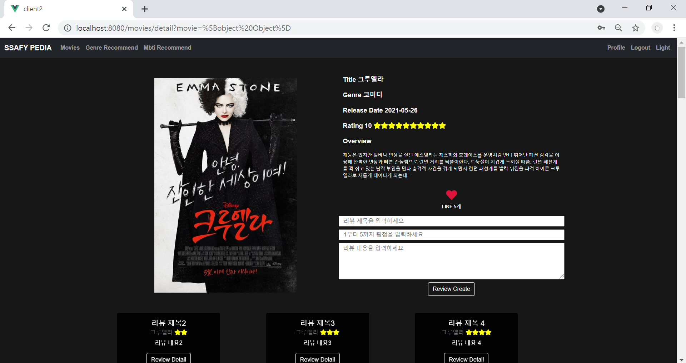


### 7. Review Detail


**Reviewer를 클릭**하면 Reviewer의 **프로필**로 이동하게 됩니다.

**프로필**에서는 **사용자가 좋아요한 영화, 사용자가 작성한 리뷰, 사용자가 작성한 댓글**을 조회할 수 있습니다.


**Movie Title을 클릭**하면 **상세 영화 조회** 페이지로 이동하게 됩니다.

상세 영화 조회 페이지로 이동하는 경우 **영화 좋아요, 리뷰 작성 및 조회**가 가능합니다.


본인의 리뷰가 **아닌** 경우 Review Update 버튼과 Review Delete 버튼을 클릭하는 경우 **경고창**이 나타납니다.

**본인의 리뷰**인 경우 Review Update 버튼과 Review Delete 버튼을 통해 리뷰를 **수정 혹은 삭제**할 수 있습니다.


**Review Update 버튼을 클릭**하면 수정 입력칸이 나타나며 **이전**에 입력된 내용이 보여집니다.

리뷰 수정은 **제목, 평점, 내용** 3가지의 값을 모두 입력해야 합니다. 평점의 경우 **1부터 5까지의 숫자를 입력**하며 **숫자의 개수만큼** 하단의 전체 리뷰 조회의 부제목으로 **별의 개수**가 **수정**되어 나타나게 됩니다.

수정 입력칸을 작성한 이후 수정을 **완료**하기 위해서는 **Review Update 버튼을 클릭**하면 리뷰 내용이 수정되며 **Updated_at의 시각**도 변경됩니다.

수정 입력칸을 **작성하지 않고** 수정 입력칸을 **닫기** 위해서는 **Cancel 버튼을 클릭**하면 수정 입력칸이 사라집니다. 


**Review Delete 버튼을 클릭**하면 리뷰가 삭제되고 **상세 영화 조회** 페이지로 이동하게 됩니다.

상세 영화 조회 페이지로 이동하는 경우 **영화 좋아요, 리뷰 작성 및 조회**가 가능합니다.


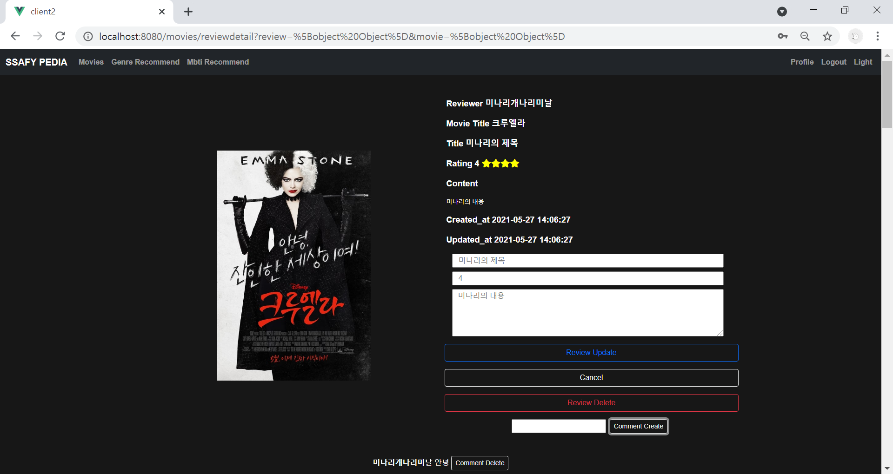


**Comment 작성자의 ID를 클릭**하면  작성자의 **프로필**로 이동하게 됩니다.

**프로필**에서는 **사용자가 좋아요한 영화, 사용자가 작성한 리뷰, 사용자가 작성한 댓글**을 조회할 수 있습니다.

**상세 리뷰 조회** 페이지에서는 사용자의 가독성을 위해 댓글 작성 시간이 나타나지 **않지만** 댓글 작성자의 ID를 클릭하여 **프로필**에서 **작성 시간을 확인**할 수 있습니다.


**Comment Create 버튼을 클릭**하면 댓글이 생성됩니다.

생성된 댓글은 하단에서 댓글의 **내용**과 댓글 **작성자**와 함께 **전체 댓글을 조회**할 수 있으며 **최신** 댓글은 **가장 하단**에 배치하게 됩니다.


**Comment Delete  버튼을 클릭**하면 리뷰가 삭제됩니다.

본인의 댓글이 **아닌** 경우 Comment Delete 버튼을 클릭하는 경우 **경고창**이 나타납니다.


### 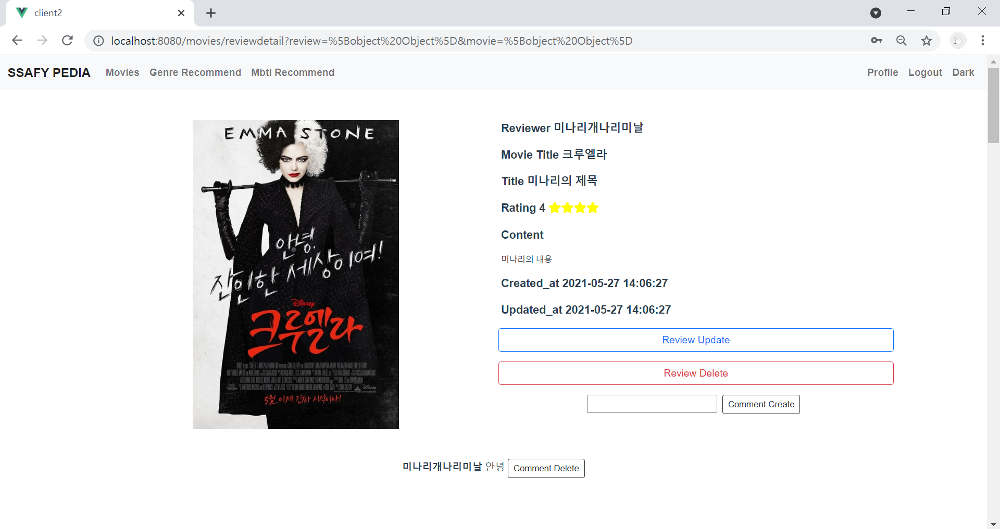

### 8. Profile 


**리뷰 작성자(Reviewer) 혹은 댓글 작성자를 클릭**하여 이동한 **프로필**에서는 **사용자가 좋아요한 영화, 사용자가 작성한 리뷰, 사용자가 작성한 댓글**을 조회할 수 있습니다.


**홈페이지 사용 메뉴얼**은 **NavBar 우측 상단**의 **Profile을 클릭**하여 **본인**의 프로필에서 확인하실 수 있습니다.


**상단**에 위치한 사용자가 좋아요한 영화는 영화 추천 페이지처럼 각 카드들이 **자동으로 이동**하여 사용자의 가독성을 높였습니다.

**카드를 클릭**하면 로그인한 경우 **상세 영화 조회 페이지**로 이동합니다.

상세 영화 조회 페이지로 이동하는 경우 **영화 좋아요, 리뷰 작성 및 조회**가 가능합니다.


**중간**에 위치한 사용자가 작성한 리뷰에서 **Review Detail 버튼을 클릭**하면 **상세 리뷰 조회 페이지**로 이동합니다.

상세 리뷰 조회 페이지로 이동하는 경우 **리뷰 조회, 수정 및 삭제**, **댓글 조회, 생성 및 삭제**가 가능합니다. 


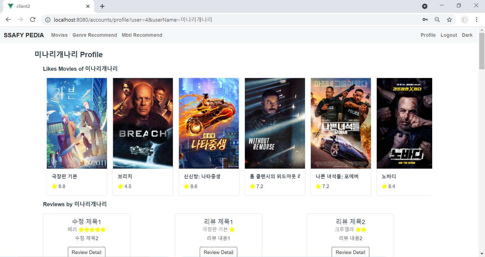


**가장 하단**에서는 사용자가 작성한 댓글들의 내용과 작성 시간을 조회할 수 있습니다. 

**REVIEW DETAIL 버튼을 클릭**하면 댓글이 작성된 **상세 리뷰 조회** 페이지로 이동합니다.

상세 리뷰 조회 페이지로 이동하는 경우 **리뷰 조회, 수정 및 삭제**, **댓글 조회, 생성 및 삭제**가 가능합니다. 

**MOVIE DETAIL 버튼을 클릭**하면 댓글이 작성된 리뷰의 해당 **상세 영화 조회** 페이지로 이동합니다.

상세 영화 조회 페이지로 이동하는 경우 **영화 좋아요, 리뷰 작성 및 조회**가 가능합니다.


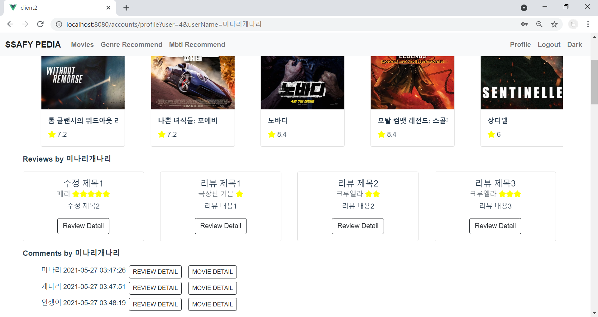

----

## Back-end


> Django Rest Framework


### 1. Folder 

|  Project  |   App    |   Data   |
| :-------: | :------: | :------: |
| final_pjt |  movies  | json_api |
|           | accounts |          |


### 2. settings.py (Project)

- `INSTALLED_APPS `
  - app 등록 (movies, accounts)
  - DRF 설치 (rest_framework)
  - corsheaders 설치 (corsheaders)
- `MIDDLEWARE` : corsheaders MIDDLEWARE
- `CORS_ALLOWED_ORIGINS` : corsheaders 연결 주소

- `AUTH_USER_MODEL` : 사용자 모델

- `JWT_AUTH` : token값 유지시간 설정

- [settings.py]

```python
# final_pjt/settings.py
INSTALLED_APPS = [
    'movies',
    'accounts',
    'rest_framework',
    'corsheaders',
    # 'django_extensions',
]
MIDDLEWARE = [
    'corsheaders.middleware.CorsMiddleware',
    'django.middleware.common.CommonMiddleware',
]
AUTH_USER_MODEL = 'accounts.User'
CORS_ALLOWED_ORIGINS = [
    'http://localhost:8080', 
]
JWT_AUTH = {
    'JWT_EXPIRATION_DELTA': datetime.timedelta(days=1),
}
```


### 3. urls.py (Project / App) 

#### (1) final_pjt (Project) 

- [urls.py]

```python
# final_pjt/urls.py
from django.contrib import admin
from django.urls import path, include
urlpatterns = [
    path('admin/', admin.site.urls),
    path('accounts/', include('accounts.urls')),
    path('movies/', include('movies.urls')),
]
```

#### (2) accounts (App) 

- [urls.py]

```python
# accounts/urls.py
from django.urls import path
from . import views
from rest_framework_jwt.views import obtain_jwt_token

app_name = 'accounts'
urlpatterns = [
    path('api-token-auth/', obtain_jwt_token),
    # 로그인
    path('signup/', views.signup, name='signup'),
    # 회원가입
    path('profile/', views.profile, name='profile'),
    # 본인 프로필
    path('<int:user_pk>/profile/', views.profile_search, name='profile_search'),
    # 검색 프로필
]
```

#### (3) movies (App) 

- [urls.py]

```python
# movies/urls.py
from django.urls import path
from . import views

app_name = 'movies'
urlpatterns = [
    path('mbti/', views.mbti, name='mbti'),
    # mbti 추천 영화 조회 (GET)
    path('mbti/<int:mbti_movie_pk>/', views.mbti_detail, name='mbti_detail'),
    # 상세 mbti 영화 조회(GET)
    
    path('', views.movie_list, name='movie_list'),
    # 전체 영화 조회(GET)
    path('genre/', views.genre, name='genre'),
    # 장르별 추천 영화 조회 (GET)
    path('recommend/', views.recommend, name='recommend'),
    # 개봉일순, 평점순 추천 영화 조회 (GET)

    path('<int:movie_pk>/', views.movie_detail, name='movie_detail'),
    # 상세 영화 조회(GET)
    path('<int:user_pk>/<int:movie_pk>/like/', views.movie_like, name='movie_like'),
    # 상세 영화 좋아요(POST)
    path('<int:movie_pk>/review/', views.review_list_create, name='review_list_create'),
    # 상세 영화 전체 리뷰 조회(GET) 리뷰 생성(POST)
    
    path('review/<int:review_pk>/', views.review_detail, name='review_detail'),
    # 상세 영화 상세 리뷰 조회(GET), 수정(PUT), 삭제(DELETE)

    path('review/<int:review_pk>/comments/', views.comment_list, name='comment_list'),
    # 상세 영화 상세 리뷰 전체 댓글 조회(GET)
    path('review/<int:review_pk>/comment/', views.comment_create, name='comment_create'),
    # 상세 영화 상세 리뷰 댓글 생성(POST)
    path('review/<int:review_pk>/comment/<int:comment_pk>/', views.comment_delete, name = 'comment_delete'),
    # 상세 영화 상세 리뷰 상세 댓글 삭제 (DELETE)

    path('<int:user_pk>/likes/', views.user_likes, name='user_likes'),
    # 사용자가 좋아요한 영화 (GET)
    path('<int:user_pk>/reviews/', views.user_reviews, name='user_reviews'),
    # 사용자가 생성한 리뷰 조회 (GET)
    path('<int:user_pk>/comments/', views.user_comments, name='user_comments'),
    # 사용자가 생성한 댓글 조회 (GET)
]
```


### 4. models.py (App)

#### (1) 외부 DB JSON (Data)

> TMDB API_KEY JSON DATABASE

- JSON Dictionary List

  - `result` : 모든 JSON Dictionary형태의 DB를 저장할 List

  - `fields` : 각 JSON Dictionary형태의 DB를 저장할 Dictionary

  - `i` : 각 JSON Dictionary형태의 pk부여

- models.py

  - `movies.mbti` : movies/models.py의 **class Mbti**에 적용

  - `movies.movie` : movies/models.py의 **class Movie**에 적용

- field

  - `key_list` : movies/models.py의 **class Mbti** 혹은 **class Movie** field와 동일하게 입력할 field의 항목들 **(장르, mbti 제외)**

  - `genre_list` : `movie['genres'][0]["name"]` `movie['genre_ids'][0]` 장르는 List로 저장되고 **복수**인 경우가 많아서 가장 앞의 인덱스를 추출한 후 **0번 인덱스([0])**의 Dictionary **Key**값 중 장르의 **이름(["name"])**에 접근하여 저장

  - `fields['mbti']` : **총 16개의 mbti**를 구별하기 위해 별도로 설정

- [json_mbti.py]

```python
# json_api/json_mbti.py
import json
import sys
def movie_info(movies_list):
    result = []
    
    genre_list = [{"pk": 28, "name": "액션"}, {"pk": 12, "name": "모험"}, {"pk": 16, "name": "애니메이션"}, {"pk": 35, "name": "코미디"}, {"pk": 80, "name": "범죄"}, { "pk": 99, "name": "다큐멘터리"}, { "pk": 18, "name": "드라마"}, { "pk": 10751, "name": "가족"}, { "pk": 14, "name": "판타지"}, { "pk": 36, "name": "역사"}, { "pk": 27, "name": "공포"}, { "pk": 10402, "name": "음악"}, { "pk": 9648, "name": "미스터리"}, { "pk": 10749, "name": "로맨스"}, { "pk": 878, "name": "SF"}, { "pk": 10770, "name": "TV 영화"}, { "pk": 53, "name": "스릴러"}, {"pk": 10752, "name": "전쟁"}, {"pk": 37, "name": "서부"}]

    key_list = ['release_date', 'title', 'poster_path', 'vote_average', 'overview']

    i = 1
    for movie in movies_list:
        fields = {}
        for key in key_list:
            fields[key] = movie[key]
        fields['genre'] = movie['genres'][0]["name"]
        fields['mbti'] = "esfj" 
        info = { 
            "model": "movies.mbti",
            "pk": i,
        }
        info["fields"] = fields
        result.append(info)
        i += 1
    return result

if __name__ == '__main__':
    movies_json = open('esfj.json', encoding='UTF8')
    movies_list = json.load(movies_json)
    
    movies = movie_info(movies_list)
    with open('mbti_esfj.json', 'w', encoding="utf-8") as f:
        json.dump(movies, f, ensure_ascii=False, indent="\t")
```

- [json_movie.py]

```python
import json
import sys

def movie_info(movies_list):
    result = []
    
    genre_list = [{"pk": 28, "name": "액션"}, {"pk": 12, "name": "모험"}, {"pk": 16, "name": "애니메이션"}, {"pk": 35, "name": "코미디"}, {"pk": 80, "name": "범죄"}, { "pk": 99, "name": "다큐멘터리"}, { "pk": 18, "name": "드라마"}, { "pk": 10751, "name": "가족"}, { "pk": 14, "name": "판타지"}, { "pk": 36, "name": "역사"}, { "pk": 27, "name": "공포"}, { "pk": 10402, "name": "음악"}, { "pk": 9648, "name": "미스터리"}, { "pk": 10749, "name": "로맨스"}, { "pk": 878, "name": "SF"}, { "pk": 10770, "name": "TV 영화"}, { "pk": 53, "name": "스릴러"}, {"pk": 10752, "name": "전쟁"}, {"pk": 37, "name": "서부"}]

    key_list = ['release_date', 'title', 'poster_path', 'vote_average', 'overview']
    
    i = 1
    for movie in movies_list:
        fields = {}
        for key in key_list:
            try:
                fields[key] = movie[key]
            except:
                continue
            for genres in genre_list:
                try:
                    if movie['genre_ids'][0] == genres["pk"]:
                        genre_name = genres["name"]
                        fields['genre'] = genre_name
                except:
                    continue
        info = { 
            "model": "movies.movie",
            "pk": i,
        }
        info["fields"] = fields
        result.append(info)
        i += 1
    return result

if __name__ == '__main__':
    movies_json = open('movies.json', encoding='UTF8')
    movies_list = json.load(movies_json)
    # print(type(movies_list))
    
    movies = movie_info(movies_list)
    with open('movie.json', 'w', encoding="utf-8") as f:
        json.dump(movies, f, ensure_ascii=False, indent="\t")
```

#### (2) 내부 DB ERD (App) 

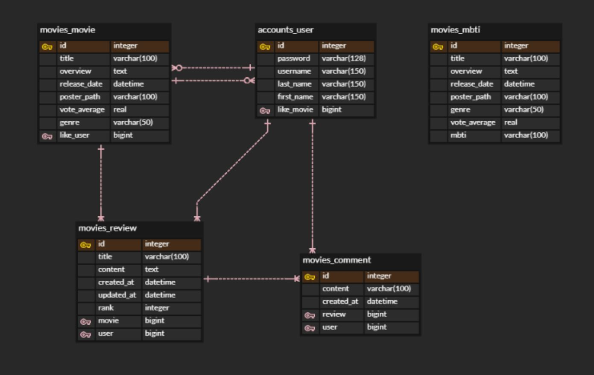

#### (3) accounts (App) 

- [models.py]

```python
# accounts/models.py
from django.db import models
from django.contrib.auth.models import AbstractUser

class User(AbstractUser):
    pass
```

#### (4) movies (App) 

- class Mbti
  - title, overview, release_date, poster_path, vote_average
  - **MBTI 유형별로 filter**하기 위한 field`mbti`
- class Movie
  - title, overview, release_date, poster_path, vote_average
  - **M : N** (`ManyToManyField`)
    - **user** : movie `like_user` `like_movies(related_name)`
- class Review
  - title, content, created_at, updated_at, rank 
  - **1 : N** (`ForeignKey`)
    - **user** : review `user` `reviews(related_name)`
    - **movie** : review `movie` `review_set`
- class Comment
  - content, created_at 
  - **1 : N** (`ForeignKey`)
    - **user** : comment `user` `comments(related_name)`
    - **review** : comment `review` `comment_set`

- [models.py]

```python
# movies/models.py
from django.db import models
from django.conf import settings
from django.core.validators import MinValueValidator, MaxValueValidator

class Mbti(models.Model):
    title = models.CharField(max_length=100)
    overview = models.TextField()
    release_date = models.DateTimeField()
    poster_path = models.CharField(max_length=100)
    genre = models.CharField(max_length=50)
    vote_average = models.FloatField()
    mbti = models.CharField(max_length=100)
    
    def __str__(self):
        return self.title

class Movie(models.Model):
    title = models.CharField(max_length=100)
    overview = models.TextField()
    release_date = models.DateTimeField()
    poster_path = models.CharField(max_length=100)
    vote_average = models.FloatField()
    genre = models.CharField(max_length=50)
    like_user = models.ManyToManyField(settings.AUTH_USER_MODEL, related_name='like_movies')

    def __str__(self):
        return self.title

class Review(models.Model):
    user = models.ForeignKey(settings.AUTH_USER_MODEL, on_delete=models.CASCADE, related_name='reviews')
    movie = models.ForeignKey(Movie, on_delete=models.CASCADE)
    title = models.CharField(max_length=100)
    content = models.TextField()
    created_at = models.DateTimeField(auto_now_add=True)
    updated_at = models.DateTimeField(auto_now=True)
    rank = models.IntegerField(validators=[MinValueValidator(0), MaxValueValidator(5)])

    def __str__(self):
        return self.title

class Comment(models.Model):
    user = models.ForeignKey(settings.AUTH_USER_MODEL, on_delete=models.CASCADE, related_name="comments")
    review = models.ForeignKey(Review, on_delete=models.CASCADE)
    content = models.CharField(max_length=100)
    created_at = models.DateTimeField(auto_now_add=True)

    def __str__(self):
        return self.content
```


### 5. serializers.py (App) 

#### (1) accounts (App)  

- user 

  - `get_user_model()` (models.py 외에 적용) 

  - `settings.AUTH_USER_MODEL` (models.py)

- field

  - username, password, first_name, last_name 

  - **write_only** : `(write_only=True)` Serialize하지만 응답에는 포함시키지 않음
    - password
  - **read_only_fields** : 유저 등록시 작성 불요
    - 좋아요한 영화 (`like_movies`) 역참조 (models.py class Movie `related_name`)
    - 작성한 리뷰 (`reviews`) 역참조 (models.py class Review `related_name`)
    - 작성한 댓글 (`comments`) 역참조 (models.py class Comment `related_name`)

- [serializers.py]

```python
# accounts/serializers.py
from django.db.models import fields
from rest_framework import serializers
from django.contrib.auth import get_user_model

User = get_user_model()

class UserSerializer(serializers.ModelSerializer):
    password = serializers.CharField(write_only=True)
    class Meta:
        model = User
        fields = ('id', 'username', 'password', 'first_name', 'last_name', 'like_movies', 'reviews', 'comments',)
        read_only_fields = ('reviews', 'like_movies', 'comments',)
```

#### (2) movies (App) 

- class CommentSerializer

  - 필드 **추가** : 상세 **리뷰** 제목 (`review_title`) **댓글** 작성자 (`userName`)

  - 외래키 작성 불요 : `read_only_fields = ('user','review',)`

- class ReviewListSerializer / ReviewSerializer

  - 필드 **추가** : 상세 **영화** 제목 (`movie_title` ) **리뷰** 작성자 (`userName`)

  - 외래키 작성 불요 :  `read_only_fields = ('user', 'movie',)`

- class MovieListSerializer / MovieSerializer

  - 외래키 작성 불요 : `read_only_fields = ('like_user', 'like_movies')`

- class MbtiListSerializer / MbtiSerializer

- [serializers.py]

```python
# movies/serializers.py
from rest_framework import serializers
from .models import Movie, Review, Comment, Mbti

# 상세 리뷰 전체 댓글 조회(GET)
class CommentSerializer(serializers.ModelSerializer):
    review_title = serializers.SerializerMethodField()
    def get_review_title(self, obj):
        return obj.review.title
    userName = serializers.SerializerMethodField()
    def get_userName(self,obj):
        return obj.user.username
    class Meta:
        model = Comment
        fields = ('id', 'userName', 'user', 'review', 'review_title', 'content', 'created_at',)
        read_only_fields = ('user','review',)

# 상세 영화 전체 리뷰 조회(GET)
class ReviewListSerializer(serializers.ModelSerializer):
    movie_title = serializers.SerializerMethodField()
    def get_movie_title(self, obj):
        return obj.movie.title
    userName = serializers.SerializerMethodField()
    def get_userName(self,obj):
        return obj.user.username
    class Meta:
        model = Review
        fields = ('id', 'userName', 'user', 'movie_title', 'movie', 'title', 'content', 'rank', 'created_at', 'updated_at',)
        read_only_fields = ('user', 'movie',)

# 상세 리뷰 조회(GET)
class ReviewSerializer(serializers.ModelSerializer):
    movie_title = serializers.SerializerMethodField()
    def get_movie_title(self, obj):
        return obj.movie.title
    userName = serializers.SerializerMethodField()
    def get_userName(self,obj):
        return obj.user.username
    class Meta:
        model = Review
        fields = ('id', 'userName', 'user', 'movie_title', 'movie', 'title', 'content', 'rank', 'created_at', 'updated_at',)
        read_only_fields = ('user', 'movie',)

# 전체 영화 조회(GET)
class MovieListSerializer(serializers.ModelSerializer):
    class Meta:
        model = Movie
        fields = '__all__'
        read_only_fields = ('like_user', 'like_movies')

# 상세 영화 조회 (GET)
class MovieSerializer(serializers.ModelSerializer):
    class Meta:
        model = Movie
        fields = '__all__'

# 전체 mbti 추천 영화 조회(GET)
class MbtiListSerializer(serializers.ModelSerializer):
    class Meta:
        model = Mbti
        fields = '__all__'

# 상세 mbti 추천 영화 조회(GET)
class MbtiSerializer(serializers.ModelSerializer):
    class Meta:
        model = Mbti
        fields = '__all__'
```


### 6. views.py (App) 

#### (1) accounts (App) 

- 회원가입 : def signup

  - `user.set_password(request.data.get('password'))`

  - 비밀번호 해싱 password는 직렬화되어도 response에서 표현되지 않는다

- 본인 프로필 : def profile

  - **본인** **JWT** `user_id` field 접근해서 Vue.js에서 url에 포함하여 axios 요청

- 검색 프로필 : def profile_search

  - **본인 및 타인** (**리뷰**작성자 / **댓글**작성자) `review.user` `comment.user`를  Vue.js에서 **정수형 전환**(`Number()`)후  `user_pk`를 url에 포함하여 axios 요청

- [views.py]

```python
@api_view(['POST'])
def signup(request):
    password = request.data.get('password')
    password_confirmation = request.data.get('passwordConfirmation')
    if password != password_confirmation:
        return Response({'error': '비밀번호가 일치하지 않습니다.'}, status=status.HTTP_400_BAD_REQUEST)
    serializer = UserSerializer(data=request.data)
    if serializer.is_valid(raise_exception=True):
        user = serializer.save()
        user.set_password(request.data.get('password'))
        user.save()
        return Response(serializer.data, status=status.HTTP_201_CREATED)

@api_view(['POST'])
def profile(request):
    user = get_object_or_404(get_user_model(), pk=request.data.get('user_id'))
    serializer = UserSerializer(user)
    return Response(serializer.data)

@api_view(['POST'])
def profile_search(request, user_pk):
    user = get_object_or_404(get_user_model(), pk=user_pk)
    serializer = UserSerializer(user)
    return Response(serializer.data)
```

#### (2) movies (App) 

- MBTI Movie (models.py **class Mbti**)

  - MBTI 영화 유형별 추천 조회 (R) : def mbti

  - MBTI 상세 영화 조회 (R) : def mbti_detail

- Movie (models.py **class Movie**)

  - 영화 조회 

    - 전체 영화 조회 (R) : def movie_list
    - 장르별 추천 영화 조회 (R) : def genre
    - 개봉일 및 평점순 추천 영화 조회 (R) : def recommend

  - 상세 영화 조회

    - 상세 영화 조회 (R) : def movie_detail

    - 상세 영화 좋아요 : def movie_like
    - 전체 리뷰 조회 (R) 및 리뷰 작성 (C) : def review_list_create

  - 상세 리뷰 조회

    - 상세 리뷰 조회 (R) 수정 (U) 및 삭제 (D) : def review_detail
    - 전체 댓글 조회 (R) : def comment_list
    - 댓글 생성 (C) : def comment_create
    - 상세 댓글 삭제 (D) : def comment_delete

- Profile (models.py **class Movie**)
  - User가 좋아요한 영화 조회 (R) :  def user_likes
  - User가 작성한 글 조회 (R) : def user_reviews
  - User가 작성한 댓글 조회 (R) : def user_comments

- [views.py]

```python
# movies/views.py
from django.shortcuts import render, get_list_or_404, get_object_or_404
from rest_framework import status
from rest_framework.response import Response
from rest_framework.decorators import api_view
# 직렬화를 위한 데코레이터 (DRF)

from rest_framework.decorators import authentication_classes, permission_classes
from rest_framework.permissions import IsAuthenticated
from rest_framework_jwt.authentication import JSONWebTokenAuthentication
# TOKEN 유효여부와 인증을 위한 데코레이터 (JWT)

from .models import Movie, Review, Comment, Mbti
from .serializers import MovieListSerializer, MovieSerializer, ReviewListSerializer, ReviewSerializer, CommentSerializer, MbtiListSerializer, MbtiSerializer
# models.py serializers.py

from django.contrib.auth import get_user_model
```

- MBTI Movie (models.py **class Mbti**)

  > Mbti model의 **mbti field**를 기준으로 **filter**
  >
  > **16가지** MBTI 유형별 추천 영화 조회

  - MBTI 영화 유형별 추천 조회 (R) : def mbti

  - MBTI 상세 영화 조회 (R) : def mbti_detail

- [views.py]

```python
# movies/views.py
@api_view(['GET'])
def mbti(request):
# mbti 영화 유형별 조회 (GET)
    estj_movies = Mbti.objects.filter(mbti="estj")
    serializer1 = MbtiListSerializer(estj_movies, many=True)
    istj_movies = Mbti.objects.filter(mbti="istj")
    serializer2 = MbtiListSerializer(istj_movies, many=True)
    estp_movies = Mbti.objects.filter(mbti="estp")
    serializer3 = MbtiListSerializer(estp_movies, many=True)
    istp_movies = Mbti.objects.filter(mbti="istp")
    serializer4 = MbtiListSerializer(istp_movies, many=True)
    infp_movies = Mbti.objects.filter(mbti="infp")
    serializer5 = MbtiListSerializer(infp_movies, many=True)
    enfp_movies = Mbti.objects.filter(mbti="enfp")
    serializer6 = MbtiListSerializer(enfp_movies, many=True)
    infj_movies = Mbti.objects.filter(mbti="infj")
    serializer7 = MbtiListSerializer(infj_movies, many=True)
    enfj_movies = Mbti.objects.filter(mbti="enfj")
    serializer8 = MbtiListSerializer(enfj_movies, many=True)
    esfp_movies = Mbti.objects.filter(mbti="esfp")
    serializer9 = MbtiListSerializer(esfp_movies, many=True)
    isfp_movies = Mbti.objects.filter(mbti="isfp")
    serializer10 = MbtiListSerializer(isfp_movies, many=True)
    entj_movies = Mbti.objects.filter(mbti="entj")
    serializer11 = MbtiListSerializer(entj_movies, many=True)
    intj_movies = Mbti.objects.filter(mbti="intj")
    serializer12 = MbtiListSerializer(intj_movies, many=True)
    isfj_movies = Mbti.objects.filter(mbti="isfj")
    serializer13 = MbtiListSerializer(isfj_movies, many=True)
    intp_movies = Mbti.objects.filter(mbti="intp")
    serializer14 = MbtiListSerializer(intp_movies, many=True)
    entp_movies = Mbti.objects.filter(mbti="entp")
    serializer15 = MbtiListSerializer(entp_movies, many=True)
    esfj_movies = Mbti.objects.filter(mbti="esfj")
    serializer16 = MbtiListSerializer(esfj_movies, many=True)
    return Response([serializer1.data, serializer2.data, serializer3.data, serializer4.data, serializer5.data, serializer6.data, serializer7.data, serializer8.data, serializer9.data, serializer10.data, serializer11.data, serializer12.data, serializer13.data, serializer14.data, serializer15.data, serializer16.data])

@api_view(['GET'])
def mbti_detail(request, mbti_movie_pk):
# mbti 상세 영화 조회 (GET)
    mbti = get_object_or_404(Mbti, pk=mbti_movie_pk)
    serializer = MbtiSerializer(mbti)
    return Response(serializer.data)
```

- Movie (models.py **class Movie**)

  - 영화 조회 

    > Movie model의 **genre field**를 기준으로 **filter**
    >
    > Movie model의 **vote_average release_date field**를 기준으로 **order_by**

    - 전체 영화 조회 (R) : def movie_list
    - 장르별 추천 영화 조회 (R) : def genre
    - 개봉일 및 평점순 추천 영화 조회 (R) : def recommend

  - 상세 영화 조회

  - 상세 리뷰 조회

- [views.py]

```python
@api_view(['GET'])
def movie_list(request):
# 전체 영화 조회 (GET)
    movies = get_list_or_404(Movie)
    serializers = MovieListSerializer(movies, many=True)
    return Response(serializers.data)

@api_view(['GET'])
def genre(request):
# 장르별 추천 영화 조회 (GET)
    action_movies = Movie.objects.filter(genre="액션")[:15]
    serializer1 = MovieListSerializer(action_movies, many=True)
    animation_movies = Movie.objects.filter(genre="애니메이션")[:15]
    serializer2 = MovieListSerializer(animation_movies, many=True)
    thriller_movies = Movie.objects.filter(genre="스릴러")[:15]
    serializer3 = MovieListSerializer(thriller_movies, many=True)
    fantasy_movies = Movie.objects.filter(genre="판타지")[:15]
    serializer4 = MovieListSerializer(fantasy_movies, many=True)
    comedy_movies = Movie.objects.filter(genre="코미디")[:15]
    serializer5 = MovieListSerializer(comedy_movies, many=True)
    romance_movies = Movie.objects.filter(genre="로맨스")[:15]
    serializer6 = MovieListSerializer(romance_movies, many=True)
    sf_movies = Movie.objects.filter(genre="SF")[:15]
    serializer7 = MovieListSerializer(sf_movies, many=True)
    return Response([serializer1.data, serializer2.data, serializer3.data, serializer4.data, serializer5.data, serializer6.data, serializer7.data])

@api_view(['GET'])
def recommend(request):
# 개봉일순, 평점순 추천 영화 조회 (GET)
    high_movies = Movie.objects.all().order_by('-vote_average')[:30]
    serializer1 = MovieListSerializer(high_movies, many=True)
    low_movies = Movie.objects.all().order_by('vote_average')[:30]
    serializer2 = MovieListSerializer(low_movies, many=True)
    recent_movies = Movie.objects.all().order_by('-release_date')[:30]
    serializer3 = MovieListSerializer(recent_movies, many=True)
    old_movies = Movie.objects.all().order_by('release_date')[:30]
    serializer4 = MovieListSerializer(old_movies, many=True)
    return Response([serializer1.data, serializer2.data, serializer3.data, serializer4.data])
```

- Movie (models.py **class Movie**)

  - 영화 조회 

  - 상세 영화 조회

    > 좋아요 여부(`liked`)와 좋아요 수(`count`) data

    - 상세 영화 조회 (R) : def movie_detail

    - 상세 영화 좋아요 : def movie_like
    - 전체 리뷰 조회 (R) 및 리뷰 작성 (C) : def review_list_create

  - 상세 리뷰 조회

- [views.py]

```python
# movies/views.py
@api_view(['GET'])
@authentication_classes([JSONWebTokenAuthentication])
@permission_classes([IsAuthenticated])
def movie_detail(request, movie_pk):
# 상세 영화 조회 (GET)
    movie = get_object_or_404(Movie, pk=movie_pk)
    serializer = MovieSerializer(movie)
    return Response(serializer.data)

@api_view(['POST'])
@authentication_classes([JSONWebTokenAuthentication])
@permission_classes([IsAuthenticated])
def movie_like(request, movie_pk, user_pk):
# 상세 영화 좋아요(POST)
    movie = get_object_or_404(Movie, pk=movie_pk)
    if movie.like_user.filter(pk=user_pk).exists():
        movie.like_user.remove(request.user)
        liked = False
    else:
        movie.like_user.add(request.user)
        liked = True
    like_status = {
        'liked':liked,
        'count':movie.like_user.count(),
    }
    return Response(like_status, status=status.HTTP_200_OK)

@api_view(['GET', 'POST'])
@authentication_classes([JSONWebTokenAuthentication])
@permission_classes([IsAuthenticated])
def review_list_create(request, movie_pk):
# 상세 영화 전체 리뷰 조회(GET) 리뷰 생성(POST)
  if request.method == 'GET':
    reviews = Review.objects.filter(movie_id=movie_pk)
    serializer = ReviewListSerializer(reviews, many=True)
    return Response(serializer.data)
  else:
    movie = get_object_or_404(Movie, pk=movie_pk)
    serializer = ReviewSerializer(data=request.data)
    if serializer.is_valid(raise_exception=True):
        serializer.save(user=request.user, movie = movie)
        return Response(serializer.data, status=status.HTTP_201_CREATED)
```

- Movie (models.py **class Movie**)
  - 영화 조회 
  - 상세 영화 조회
  - 상세 리뷰 조회
    - 상세 리뷰 조회 (R) 수정 (U) 및 삭제 (D) : def review_detail
    - 전체 댓글 조회 (R) : def comment_list
    - 댓글 생성 (C) : def comment_create
    - 상세 댓글 삭제 (D) : def comment_delete
- [views.py]

```python
# movies/views.py
@api_view(['GET', 'DELETE', 'PUT'])
@authentication_classes([JSONWebTokenAuthentication])
@permission_classes([IsAuthenticated])
def review_detail(request, review_pk):
# 상세 영화 상세 리뷰 조회(GET), 수정(PUT), 삭제(DELETE)
    review = get_object_or_404(Review, pk=review_pk)
    if request.method == 'GET':
        serializer = ReviewSerializer(review)
        return Response(serializer.data)
    else:
        if request.user == review.user:
            if request.method == 'DELETE':
                review.delete()
                data = {
                    f'{review_pk}번 리뷰가 삭제되었습니다.'
                }
                return Response(data, status=status.HTTP_204_NO_CONTENT)
            if request.method == 'PUT':
                serializer = ReviewSerializer(review, data=request.data)
                if serializer.is_valid(raise_exception=True):
                    serializer.save()
                    return Response(serializer.data)
        else:
            return Response(status=status.HTTP_403_FORBIDDEN)

@api_view(['GET'])
def comment_list(request, review_pk):
# 상세 영화 상세 리뷰 전체 댓글 조회(GET)
    review = get_object_or_404(Review, pk=review_pk)
    comments = review.comment_set.all()
    serializers = CommentSerializer(comments, many=True)
    return Response(serializers.data)

@api_view(['POST'])
@authentication_classes([JSONWebTokenAuthentication])
@permission_classes([IsAuthenticated])
def comment_create(request, review_pk):
# 상세 영화 상세 리뷰 댓글 생성(POST)
    review = get_object_or_404(Review, pk=review_pk)
    serializer = CommentSerializer(data=request.data)
    if serializer.is_valid(raise_exception=True):
        serializer.save(user=request.user, review = review)
        return Response(serializer.data, status=status.HTTP_201_CREATED)

@api_view(['DELETE'])
@authentication_classes([JSONWebTokenAuthentication])
@permission_classes([IsAuthenticated])
def comment_delete(request, review_pk, comment_pk):
# 상세 영화 상세 리뷰 상세 댓글 삭제 (DELETE)
    comment = get_object_or_404(Comment, pk=comment_pk)
    if request.user == comment.user:
        comment.delete()
        data = {
            'delete': f'댓글 {comment_pk}번이 삭제되었습니다.'
        }
        return Response(data, status=status.HTTP_204_NO_CONTENT)
    return Response(status=status.HTTP_403_FORBIDDEN)
```

- Profile (models.py **class Movie**)

  > `data` : 좋아요한 영화, 작성한 글, 작성한 댓글의 Serializer를 저장할 List
  >
  > `movies_pk` , `reviews_pk`,  `comments_pk`  : Vue에서 받은 data 순회하며 List(`data`)에 추가(`append`)

  - **Vue.js** : Profile.vue 혹은 MyProfile.vue에서 `user.like_movies` , `user.reviews`, `user.comments`의 **역참조**한 각 **pk의 리스트를 request**로 저장하여 전송하며 django **axios** 요청
  - **Django** :  좋아요한 영화, 작성한 글, 작성한 댓글의 **각 pk의 리스트** `request.data`

  - User가 좋아요한 영화 조회 (R) :  def user_likes
  - User가 작성한 글 조회 (R) : def user_reviews
  - User가 작성한 댓글 조회 (R) : def user_comments

- [views.py]

```python
# movies/views.py
@api_view(['POST'])
def user_likes(request, user_pk):
# 사용자가 좋아요한 영화
  user = get_object_or_404(get_user_model(), pk=user_pk)
  data = []
  movies_pk = request.data
  for movie_pk in movies_pk:
    movie = get_object_or_404(Movie, pk=movie_pk)
    serializer = MovieSerializer(movie)
    data.append(serializer.data)
  return Response(data)

@api_view(['POST'])
def user_reviews(request, user_pk):
# 사용자가 생성한 리뷰 조회
  user = get_object_or_404(get_user_model(), pk=user_pk)
  data = []
  reviews_pk = request.data
  for review_pk in reviews_pk:
    review = get_object_or_404(Review, pk=review_pk)
    serializer = ReviewSerializer(review)
    data.append(serializer.data)
  return Response(data)

@api_view(['POST'])
def user_comments(request, user_pk):
# 사용자가 생성한 댓글 조회
  user = get_object_or_404(get_user_model(), pk=user_pk)
  data = []
  comments_pk = request.data
  for comment_pk in comments_pk:
    comment = get_object_or_404(Comment, pk=comment_pk)
    serializer = CommentSerializer(comment)
    data.append(serializer.data)
  return Response(data)
```


### 7. admin.py (App)

#### (1) accounts (App) 

- [admin.py]

```python
# accounts/admin.py
from django.contrib import admin
from django.contrib.auth.admin import UserAdmin
from .models import User

admin.site.register(User, UserAdmin)
```

#### (2) movies (App) 

- [admin.py]

```python
# movies/admin.py
from django.contrib import admin
from .models import Movie, Review, Comment

class MovieAdmin(admin.ModelAdmin):
  list_display = ['pk', 'title']
class ReviewAdmin(admin.ModelAdmin):
  list_display = ['pk', 'title']
class CommentAdmin(admin.ModelAdmin):
  list_display = ['pk', 'content']

admin.site.register(Movie, MovieAdmin)
admin.site.register(Review, ReviewAdmin)
admin.site.register(Comment, CommentAdmin)
```


